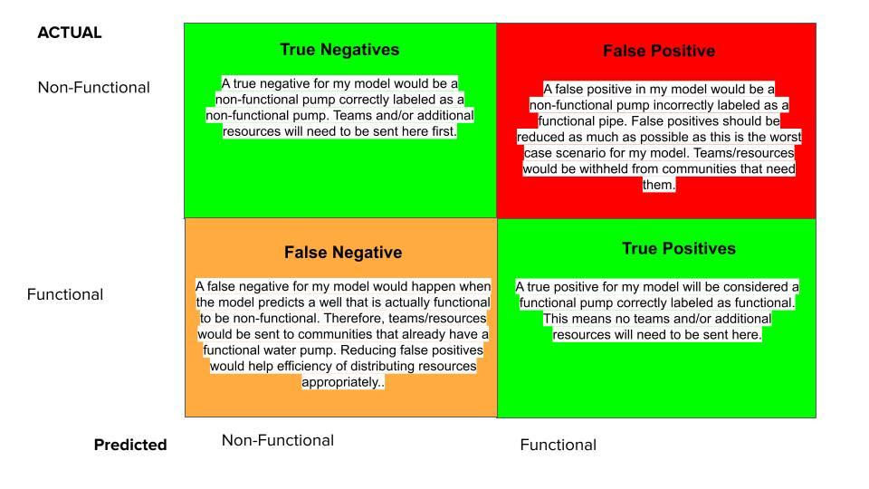

# Predictive Maintenance of Water Pumps in Tanzania
## Using a Machine Learning Classifier

**Author:** Dylan Dey

This project it available on github here: [github link](https://github.com/ddey117/Tanzanian_Water_Pump_Classification)


## Overview

The website ['DrivenData'](https://www.drivendata.org/about/) finds partners to collaborate with in order to aggregate data to make available in an open competition of Data Scientists from around the globe to come together to solve large social issues. For this project, DrivenData partnered with Taarifa and the Tanzanian Ministry of Water in order to predict the functionality of water pumps in the country of Tanzania. Machine learning classifiers from the [‘scikit-learn ‘](https://scikit-learn.org/stable/) library were used to create a model for predictive maintenance of the water pumps. 

## Business Problem
Although Tanzania has a relatively abundant amount of surface water with a number of lakes and rivers, a large portion of the country is arid and must depend on groundwater from communal bore holds in order to survive. 

Keeping potable groundwater easily accessible to large populations is no easy task. In a country where so much of the population depends on access to groundwater for survival, it is crucial to be able to systemically maintain the infrastructure that is functional and urgently address the infrastructure that is not working

The most common form of maintenance for these points is to repair them once they are no longer functional. This is not very efficient and is somewhat expensive, but it is magnitudes cheaper than establishing a new water point through drilling and installing of large equipment. 

A better approach would be to prevent repairs from becoming necessary in the first place. 
Predictive maintenance constantly monitors the status of pumps in order to more efficiently maintain them. This is the goal of this project. Timely verification of the status of water pumps in the region can prevent further compounding of issues and can reduce maintenance costs significantly. Most importantly, it can bring fresh water to those who need it in a more efficient manner than before it was implemented.

For the past two decades, the Ministry of Water has been implementing sector reforms that aim at improving resource management and improving water supply in both rural and urban environments. An attempt to determine if predictive maintenance could help the Ministry of Water in the overall success of their mission statement.


## Data
The goal for the competition is to create a tertiary classifier with high accuracy.


For my project, I am going to import some data from other sources and instead solve for a binary classifcation to simplify class imbalances. Future work can focus on more sophisticated balancing methods to solve for a tertiary classification problem.

Below is an unpdated map for a binary classifcation model.


  
 For the 60,000 pumps given by DrivenData, 54% are labeled as functional and 46$ are labeled as non-functional.
 
 QGIS software and a shapefile from USGS was used to create a new boolean feature describing whether a water pump is near a river or not.
 
 
 #### Adding Population data by ward


The column describing population is heavily skewed towards a value of zero, and it would seem very unlikely for so many wells to have a population of zero. Nearly 50% of the data is skewed towards a value of either zero or one. It is hard to trust the validaty of this column. I decided to drop this column and bring in population information by ward collected by government census in 2012. This data has its own issues but I believe it to be a more complete dataset and give a better idea about the number of people who could benefit from the presence of a functional well in their area. Ward is a high level geological feature with thousands of divisions for Tanzania.
 
 
 
Below are the columns from the DrivenData dataset that I decided to drop initially and the reasoning behind dropping the column. This step will help overall model speeds and should reduce the chance of overfitting by cutting down on multicolinearity. 

**id:** uninformitave  
**recorded_by:** constant, unimportant for model  
**num_private:** nearly 99% zeroes. Uninformative for model.  
**waterpoint_type_group:** redundant. waterpoint_type covers same information.  
**source:** Explains same information as source_type but with more variables. Keeping source_type.  
**source_class:** Broadly explains same information as source and source_type. Keeping source_type.  
**Source_type:** This was NOT dropped. Kept it as a balance between the other two features of similar information.  
**extraction_type:**  explains similar information as extration_type_group and extraction_type_class. Dropped.   
**extraction_type_group:** explains similar information as extration_type and extraction_type_class. Dropped.   
**extraction_type_class:** broadly explains similar information as extraction_type and extraction_type_group. Kept.  
**payment:** redundant information. Keep this and drop 'payment type'    
**payment_type:** Same information as payment. Drop.   
**management:** keep this and drop 'management_type'.       
**management_group:** drop. Information contained within management column.     
**scheme_name:** drop. Missing almost half of values. Large cardinality (nearly 2700 categories).    
**scheme_manager:** drop. Contains similar information to management column.        
**water_quality:** Keep this and drop 'quality group.'  
**water_quantity:** Keep this and drop water_quantity. They contain identical information.  
**date_recorded:** administrative. Not predictive.   
**latitude**: No clear relationship between coordinate and pump status after viewing map. There is some obvious clustering though. Hope to get enough information from the other geological categorical features. Basin is likely to always show up in feature data as it is most general. Latitude and longitude for the pumps may even be imputed from mean or median values based on ward or some other common geological boundaries. Dropped.  
**longitude**: See above comments on latitude. Dropped.


Functions were created to deal with zero skewed data, high cardinality data, and null values. Please visit the juypyter notebooks for more information.

## Classification Metric Understanding

Below is a confusion matrix that would be produced from a model performing predictive maintenance on behalf of the Ministry of Water. There are four possible outcomes to be considered. The confusion matrix below is a visual aid to help in understanding what classification metrics to consider when building the model.  



A true positive in the current context would be when the model correctly identifies a functional pump as functional. A true negative would be when the model correctly identifies a non-functional pump as non-functional. Both are important and both can be described by the overall **accuracy** of the model.

True negatives are really at the heart of the model, as this is the situation in which the Ministry of Water would have a call to action. An appropriately outfitted team would be set to *all* pumps that my model identifies as non-functional. Thus, this is the situation in which the correct resources are being derived to the correct water pumps as quickly as possible. High accuracy would mean that more resources are going to the correct locations from the get-go. 

True positives are also important. This is where the model will really be saving time, resources, and money for the Ministry of Water. *Any* pumps identified as functional would no longer need to be physically checked and the Ministry of Water can withhold additional resources from going to pumps that do not actually need them. 

Notice the emphasis on *any* and *all* pumps in my description of true negatives and true positives above. The true cost/resource analysis is really the consideration of this fact: no model I create will ever correctly identify every single pump appropriately. This is the cost of predictive maintenance and a proper understanding of false positives and false negatives is extremely important in production of classification models in the given context.

False positives in the current context are the worst case scenario for modeling. This is the scenario in which the model **incorrectly** identifies a non-functional model as functional. Thus, resources would be withheld and no team would be sent to physically check these pumps, as the Ministry of Water would have to assume they are indeed functional if they want to use the model appropriately. False positives therefore describe the number of non-functional pumps that will go unvisited and unfixed until they can be resolved by other means. Reducing false positives as much as possible is very important.

Well, why would I want to build the model if these false positives cannot be completely avoided? Cost/resource management, of course! Afterall, it is about making sure as many people get clean water as quickly as possible. The reality is there that resources are finite, and without the model the Ministry of Water likely would not have the resources to physically check all the pumps and then fix all of the pumps in any sort of reasonable timeline, and even less communities would have access to fresh water when compared to using the model for predictive maintenance. 

False negatives are also important to consider. While false positives can be considered more harmful overall, false negatives are also important to reduce as much as possible. In the given context, false negatives describe the situation in which the model **incorrectly** identifies a functional pump as non-functional. Because the Ministry of water will deploy fully equipped teams to visit all pumps that my model predicts to be non-functional, these will be the pumps that will waste resources. Resources will be sent to locations that they aren't needed, and the metric that describes this would be false negatives. Thus, reduction of false negatives is essential in improving the efficiency of resource management through predictive maintenance. 

In summary, overall accuracy of the model and a reduction of both false negatives and false positives are the most important metrics to consider when developing a model in this context. More specifically, models will be tuned to **maximize accuracy and f1-score.**

Accuracy: The number of correct predictions made by model divided by the total number of predictions. This measures how succesfull my model is at labeling functional pumps as functional and non functional pumps as non functional. It is a very important metric to consider.   


f1-score: I stated above that both false negatives and false positives are important to avoid. This means that I really want precision and recall to go be high and therefore false negatives and false positives to be low. The f1-score is the harmonic mean of precision and recall. Maximizing for this metric is the best way to get a balance of both false positives and false negatives.

### Modeling

Logistic Regression, Random Forest Classification, and XGBoost Classification models were created and tested. Random search grids were used to narrow down parameters to run a full grid search to tune hyperparamters for each type of model. Please visit the modeling notebook for more information.  

## Evaluation

My random forest models outperformed my best logistic regression and XGSBoost models in regards to the metrics that are most important given the business problem at hand.

The best random forest model had a great balance between accuracy, precision, and f1-score. 

11.63% of pumps would be misclassified as functional using my best model. This means that 11.63% of the pumps would go untreated if this classifier was deployed to conduct predictive maintenance. However, it correctly identifies a high number of functional pumps correctly, which would save a lot of valuable resources, time and money, and it also identifies a large number of non-functional pumps correctly. Only a8.05% of functional pumps would be incorrectly identified as non-functional. This is the resource/time/money sink of my model, so keeping it so low is great.  


## Conclusions
I believe that my best classification model provides a powerful enough predictive ability to prove very valuable to the Ministry of Water. The amount of resources saved, the relatively low number of misclassified functional pumps, and the elimination of the need to physically sweep the functionality of all pumps can bring access to potable drinking water to a larger number of communities than before without predictive maintenance.


Author Name: Dylan Dey

Email: ddey2985@gmail.com

Github: [Dddey Github](https://github.com/ddey117/Tanzanian_Water_Pump_Classification)


## For More Information

Please review our full analysis in the [Exploratory Jupyter Notebook](./Tzn_Wtr_Pump_Data_Exploration.ipynb) and the [Modeling Jupyter Notebook](Water_Pump_Modeling.ipynb) or our [presentation](./Project_Presentation.pdf).

For any additional questions, please contact:

Author Name: Dylan Dey

Email: ddey2985@gmail.com

Github: [Dddey Github](https://github.com/ddey117/Tanzanian_Water_Pump_Classification)

## Repository Structure

Describe the structure of your repository and its contents, for example:

```
├── README.md                           <- The top-level README for reviewers of this project
├── dsc-phase1-project-template.ipynb   <- Narrative documentation of analysis in Jupyter notebook
├── DS_Project_Presentation.pdf         <- PDF version of project presentation
├── data                                <- Both sourced externally and generated from code
└── images                              <- Both sourced externally and generated from code
```
